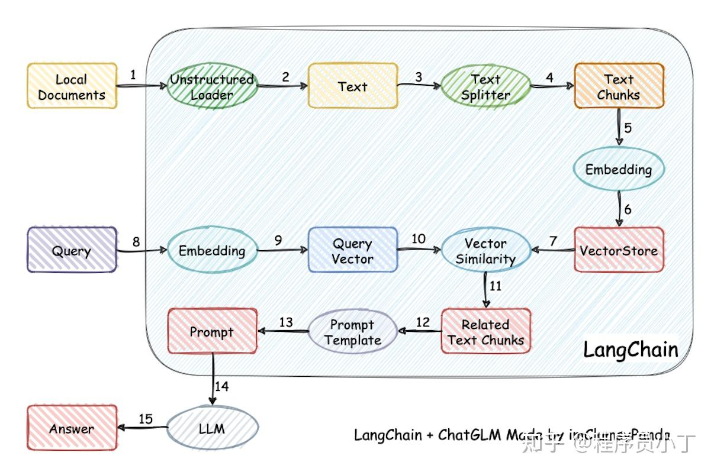
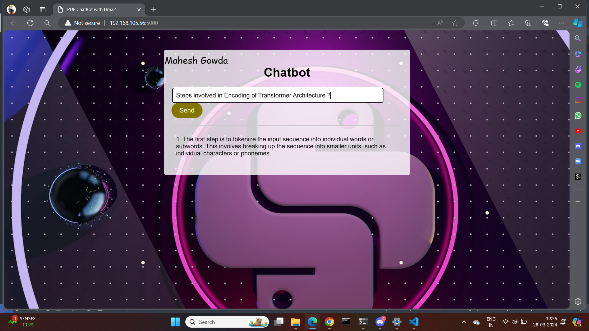
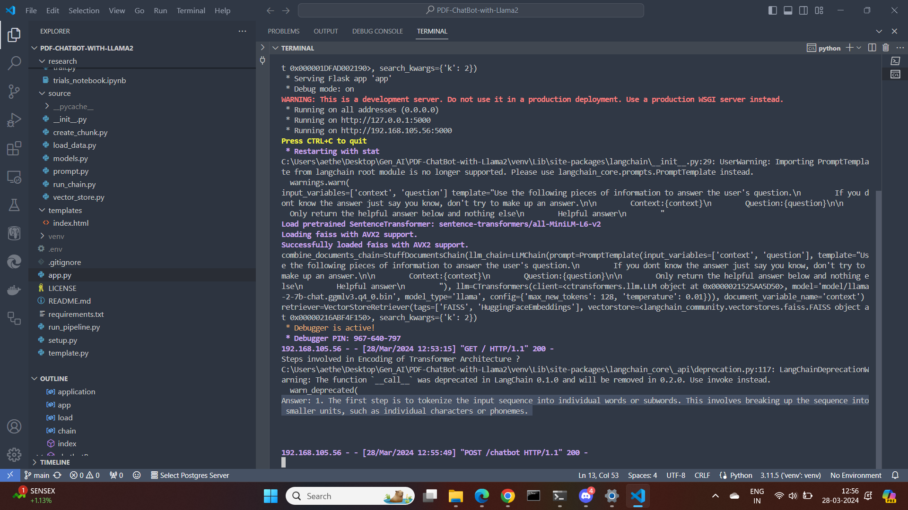

## **PDF-ChatBot-with-Llama2**


    The PDF chatbot is a cutting-edge application developed using state-of-the-art natural language processing (NLP) technologies and frameworks. The chatbot leverages Llama2, a powerful language model, and Hugging Face embeddings to understand and generate text responses effectively. It is integrated into a web interface using Flask, providing users with easy access through a browser.

**Key Components:**

1. **Llama2 Language Model** : Llama2 is a sophisticated language model renowned for its ability to comprehend and generate human-like text responses. It serves as the backbone of the chatbot's natural language understanding and generation capabilities.
2. **Hugging Face Embeddings** : The chatbot utilizes embeddings from the Hugging Face library, which encapsulates pre-trained transformer-based models. These embeddings help in representing text data in a structured and meaningful way, enhancing the chatbot's understanding of user inputs and context.
3. **Langchain Framework** : Langchain framework likely provides a structured approach for managing and orchestrating various NLP-related tasks within the chatbot, ensuring efficient processing of text data and seamless interactions with users.
4. **FLASS for Vector Database Management** : Implemented FLASS to manage vector databases efficiently, enabling rapid storage and retrieval of PDF-related data. This ensures that the chatbot can access relevant information quickly when responding to user queries.
5. **Flask for Website** : Flask, a lightweight web framework for Python, is employed to develop the web interface for the chatbot. Flask enables the integration of the chatbot into a user-friendly website, allowing users to interact with it through their web browsers conveniently.

### **BluePrint :**



### **ChatBot execution :**





### **Step to follow:**

**1.Clone the repository:**

```
git clone https://github.com/MaheshGowda47/PDF-ChatBot-with-Llama2.git
```

**2.create virtual environment:**

```
python -m venv venv
```

**3.Activate virtual environment**

```
venv\Scripts\activate
```

**4.Download Llma2 model**

```
## From the following link:
https://huggingface.co/TheBloke/Llama-2-7B-Chat-GGML/tree/main
```

Store the Llma2 model in model folder

**5.Install the requirements**

```
python pip install -r requirements.txt
```

**6.Run the project**

```
python app.py
```
